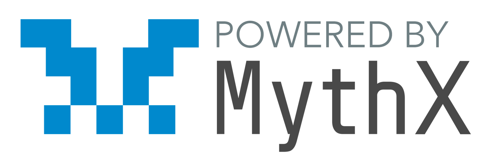

# Awesome MythX Smart Contract Security Tools

	

[MythX](https://mythx.io) is a smart contract security analysis API for that supports Ethereum, Quorum, Vechain, Roostock, Tron and other EVM-compatible blockchains. This is a curated list of developer tools built on MythX.

## IDE

- [Remix IDE](https://remix.ethereum.org/) - Activate the "MythX Security Verification" module in plugin manager ([Howto](https://docs.mythx.io/en/latest/tools/remix/index.html))
- [MythX Plugin for Truffle](https://github.com/ConsenSys/truffle-security) - Security verification plugin for the [Truffle Framework](https://truffleframework.com)
- [MythX for VS Code](https://marketplace.visualstudio.com/items?itemName=mirkogarozzo.mythxvsc) - MythX Extension for Visual Studio Code
- [Brownie](https://github.com/iamdefinitelyahuman/brownie) - Python framework for Ethereum smart contract deployment ([native integration](https://eth-brownie.readthedocs.io/en/latest/quickstart.html?highlight=mythx#scanning-for-security-vulnerabilities))
- [MythX Plugin for Embark](https://github.com/flex-dapps/embark-mythx) -  Security verification plugin for [Status Embark](https://embark.status.im) by [Flex Dapps](https://flexdapps.com)
- [Truffle Sca2t](https://github.com/tagomaru/truffle-sca2t) - Smart contract audit assistant (generates Mocha test files for CI)

## Command-Line Tools

- [MythX CLI](https://github.com/dmuhs/mythx-cli) -  Official command-line tool maintained by MythX
- [Sabre](https://github.com/b-mueller/sabre) - JavaScript CLI for the MythX API
- [Mythos](https://github.com/cleanunicorn/mythos) - Another JavaScript client for the MythX API

## Language Bindings

- [MythXJS](https://github.com/ConsenSys/mythxjs)  - MythX JavaScript library
- [PythX](https://github.com/dmuhs/PythX) - A Python library for the MythX platform

## Continuous Integration

- [GuardRails](https://www.guardrails.io/en) - Realtime feedback on Github repositories powered by MythX
- [GitMythX](https://github.com/apps/gitmythx) - MythX Github app

## Support and Documentation

- [MythX Developer and User Guide](https://docs.mythx.io/en/latest/)
- [MythX Community Discord](https://discord.gg/kktn8Wt)

## Howtos

- [Detecting Generic Smart Contract Vulnerabilities with MythX](https://medium.com/consensys-diligence/detecting-the-top-4-critical-smart-contract-vulnerabilities-with-mythx-9c568d7db7a6)
- [Checking Custom Security Properties with the MythX Plugin for Remix](https://medium.com/coinmonks/advanced-smart-contract-security-verification-in-remix-9630b43695e5)
- [Checking Custom Correctness Properties of Smart Contracts Using the AssertionFailed Event](https://medium.com/consensys-diligence/checking-custom-correctness-properties-of-smart-contracts-using-mythx-25cbac5d7852)
- [Using MythX in CircleCI](https://blog.mythx.io/howto/mythx-and-continuous-integration-part-1-circleci/)

## Articles & Papers

- [The Tech Behind MythX](https://medium.com/consensys-diligence/the-tech-behind-mythx-smart-contract-security-analysis-32c849aedaef)
- [Harvey Greybox Fuzzing Article Series](https://medium.com/consensys-diligence/finding-vulnerabilities-in-smart-contracts-175c56affe2)
- [Fuzzing Smart Contracts Using Input Prediction](https://medium.com/consensys-diligence/fuzzing-smart-contracts-using-input-prediction-29b30ba8055c)
- [Fuzzing Smart Contracts Using Multiple Transactions](https://medium.com/consensys-diligence/fuzzing-smart-contracts-using-multiple-transactions-51471e4b3c69)
- [Intro to Symbolic Execution in Mythril](https://medium.com/@joran.honig/introduction-to-mythril-classic-and-symbolic-execution-ef59339f259b)
- [Learning Inputs in Greybox Fuzzing](https://arxiv.org/pdf/1807.07875.pdf)
- [Smashing Smart Contracts (HITB GSEC 2018)](https://conference.hitb.org/hitbsecconf2018ams/materials/D1T2%20-%20Bernhard%20Mueller%20-%20Smashing%20Ethereum%20Smart%20Contracts%20for%20Fun%20and%20ACTUAL%20Profit.pdf)
- [Advances in Smart Contract Vulnerability Detection (DEFCON 27)](https://github.com/b-mueller/smashing-smart-contracts/blob/master/DEFCON27-EVM-Smart-Contracts-Mueller-Luca.pdf)
- [Practical Mutation Testing in Smart Contracts](https://www.researchgate.net/publication/335937116_Practical_Mutation_Testing_for_Smart_Contracts)
